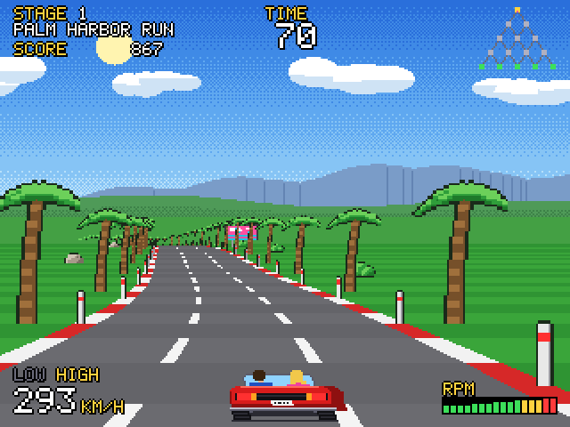
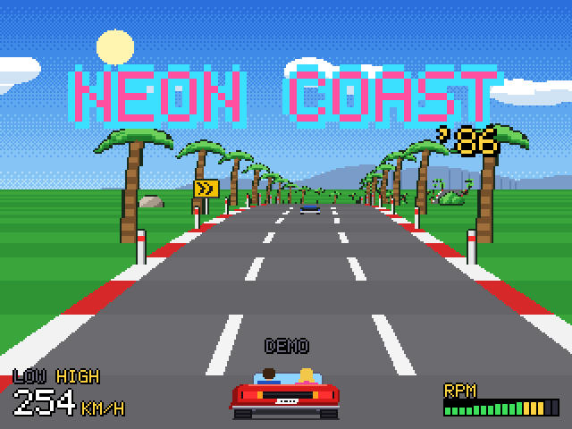
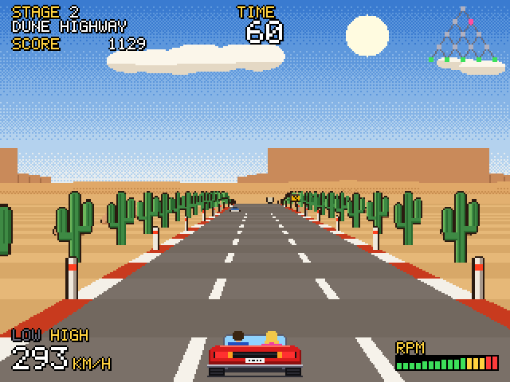
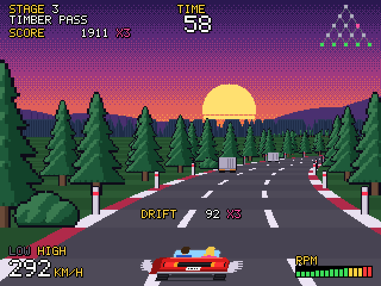
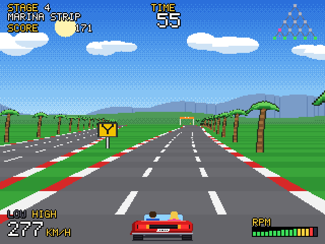
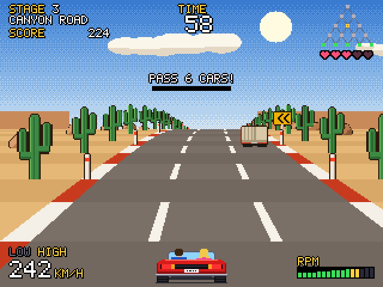
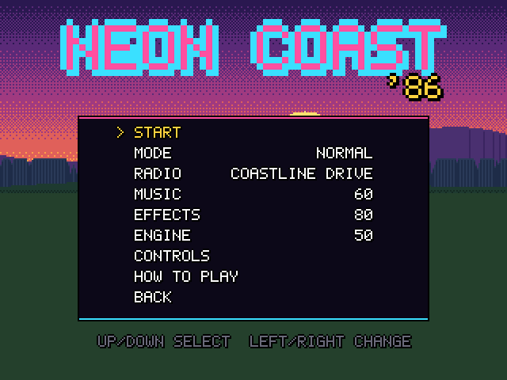
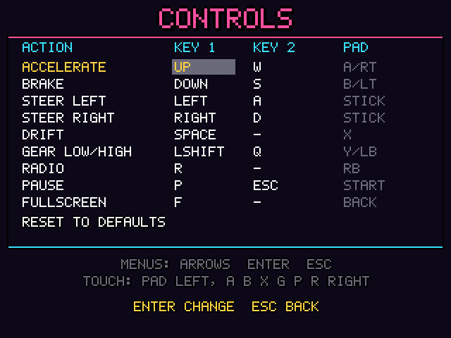
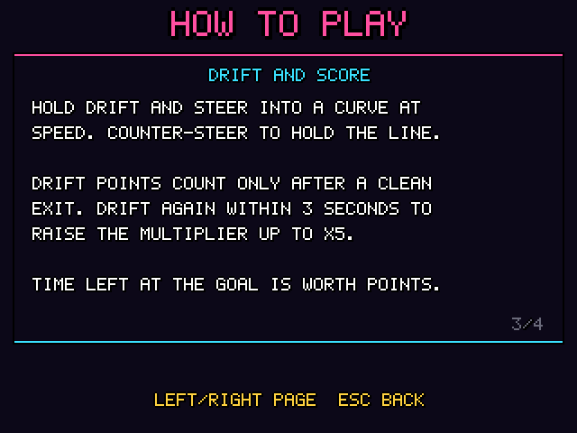
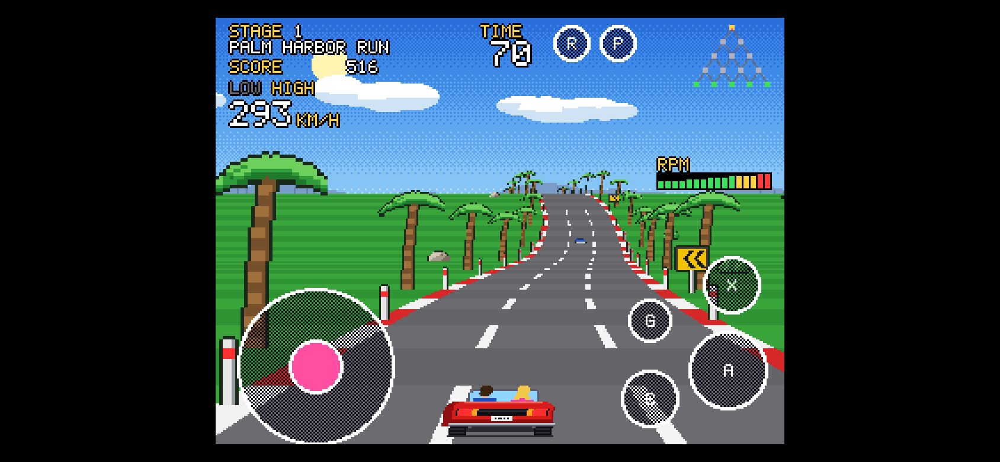

# NEON COAST '86

A pseudo-3D arcade racer for the browser in 1980s pixel-art style. A red convertible, the coast, the
desert and a pine forest at dusk, 15 sections arranged as a pyramid, 5 different goals and a clock that
counts down without mercy.

Plain JavaScript, Canvas 2D and Web Audio – **no libraries, no image files, no sound files**.
Every sprite pixel, every sky, the engine sound and all three radio songs are generated in code from data.



## Gallery

| | |
|---|---|
|  |  |
| Title screen with a driving demo (attract mode) | Desert at noon, with traffic |
|  |  |
| Drifting at dusk – points and a ×3 multiplier | A fork – pick the left or the right branch |
|  |  |
| "Passenger" mode – her task and her mood in hearts | Menu: mode, radio, volumes |
|  |  |
| CONTROLS screen – rebind your keys | How to play |



*Phone in landscape – steering pad and touch buttons.*

## Features

- **Pseudo-3D road engine** – smooth curves and hills, the road disappears behind crests, 3 parallax
  layers, a sky dithered with a Bayer matrix.
- **15 sections, 5 goals** – at the end of every stage the road really splits into two carriageways;
  your choice decides the route. Checkpoints add time, TIME UP ends the game.
- **3 themes** (coast, desert, pine forest at dusk) with smooth palette transitions between sections.
- **Physics** – LOW/HIGH gears, centrifugal force, a shoulder that slows you down, slower uphill.
- **Drift** – less centrifugal force, but the tail pulls the car to the inside of the curve; points
  count only after a clean exit, chained drifts build a multiplier up to ×5.
- **Traffic** – 4 vehicle types, AI that changes lanes and never crashes into itself; collisions and
  crashes that put you back on the road.
- **"Passenger" mode** – 7 task types matched to the section, a mood of 0–5 hearts and 15 endings that
  depend on it.
- **Radio** – 3 original songs played by a custom sequencer, engine sound, tyre screech, 15 effects.
- **Shell** – title screen with a demo, menu, pause, top-10 score table (localStorage), how-to-play
  pages and **custom key bindings**.
- **Mobile** – touch controls, fullscreen, automatic quality reduction on slower hardware.

## Running the game

All you need is a browser (plus Node.js 18+ for the build and the tests – no npm packages).

```bash
# development mode (ES modules need an HTTP server)
python3 -m http.server 8080
# then open: http://localhost:8080/index.html

# single HTML file that works when opened from disk (file://)
node tools/build.mjs
# output: dist/neon-coast.html

# logic tests (node:assert, no framework)
node tools/test.mjs
```

## Controls

| Action | Keyboard | Gamepad | Touch |
|---|---|---|---|
| Throttle | ↑ / W | A / RT | A |
| Brake | ↓ / S | B / LT | B |
| Steer | ← → / A D | left stick / D-pad | steering pad |
| Drift | Space | X | X |
| Gear LOW/HIGH | Shift / Q | Y / LB | G |
| Radio | R | RB | R |
| Pause | P / Esc | Start | P |
| Fullscreen | F | Back | first touch |

The driving keys can be changed in the **CONTROLS** menu (two keys per action, saved in the browser).
Menus always work with the arrows, Enter and Esc.

### URL parameters (debug)

| Parameter | Effect |
|---|---|
| `?debug=1` | debug overlay (F1 toggles it) |
| `?section=C2` | start straight away at the given section |
| `?passenger=1` | passenger mode for a quick start |
| `?seed=1234` | repeatable traffic and tasks |
| `?god=1` | no collisions and no time limit |
| `?mute=1` | mute |
| `?test=1` | looping test track for performance measurements |

## Project layout

```
src/
  engine/   fixed-timestep loop, input (keyboard, gamepad, touch), RNG, math
  world/    track and forks, player physics, traffic, collisions, particles
  game/     race rules, scoring, passenger mode, demo autopilot
  render/   road, sky, sprites, HUD, UI, bitmap font
  gfx/      pixel art as ASCII data + frame generators
  audio/    mixer, synthesizer, sequencer, songs, effects
  data/     sections, themes, vehicles, tasks, goals, texts
  state/    screens: title, menu, race, pause, results, name entry, controls, how to play
tools/      single-file build, tests
```

Every tunable number (speeds, forces, times, volumes) is in `src/config.js`, and routes, themes, songs
and tasks are data in `src/data/` and `src/audio/songs.js` – the game is tuned by editing data, not logic.

## How it was made

The game was written stage by stage with **Claude Code** (an AI coding agent by Anthropic).
[`CLAUDE.md`](CLAUDE.md) is the full specification and working rules for the agent: architecture, data
formats, the Definition of Done of every stage and the report format. The stage-by-stage history is in
[`CHANGELOG.md`](CHANGELOG.md), together with the list of known issues.

All content – graphics, music, route names and the car – is original.
